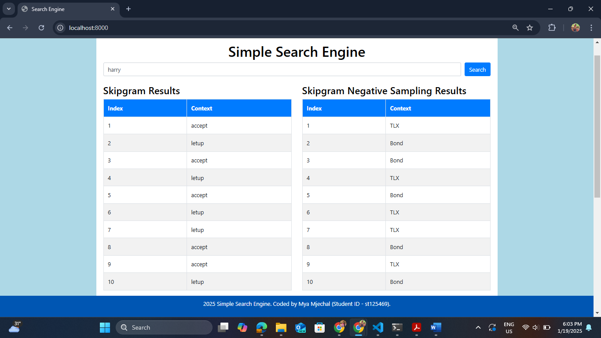
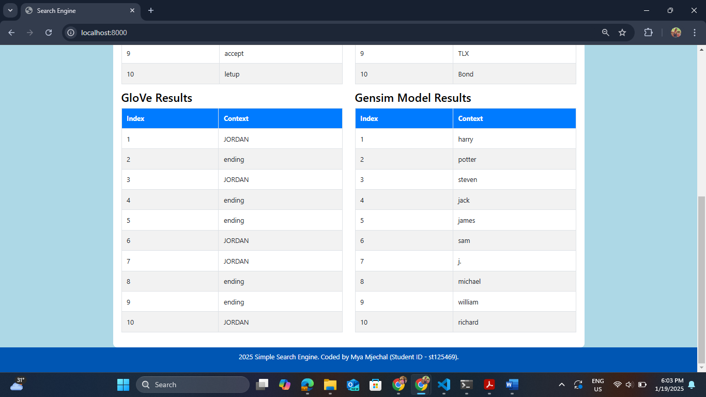

# NLP Assignment 1 (That's What I LIKE)
## Table of Contents
- [Student Information](#student-information)
- [System OverView](#system-overview)
- [Dataset](#dataset)
- [Installation Setup](#installation-setup)
- [Usage](#usage)
- [Screenshots of Website Working](#screenshots-of-website-working)
- [Model Comparison and Analysis](#model-comparison-and-analysis)
- [Similarity Scores](#similarity-scores)

## Student Information
- **Name:** Mya Mjechal
- **Student ID:** st125469
- **Major:** AIT - Data Science and Artificial Intelligence (DSAI)
- **Course:** AT82.05: Artificial Intelligence: Natural Language Understanding
- **Assignment:** NLP A1

## System Overview
This project is based on the [`A1_That_s_What_I_LIKE.pdf`](https://github.com/MyaMjechal/nlp-a1-thats-what-i-like/blob/main/A1_That_s_What_I_LIKE.pdf) document. The "That's What I LIKE" system is an NLP application that identifies contextually similar words or paragraphs for a given query. It evaluates and compares four word embedding models:
1. Skipgram
2. Skipgram with Negative Sampling
3. GloVe
4. GloVe (Gensim)

### Workflow
- **Input:** Users provide a query(a single word) via a web interface.
- **Processing:** Models process the query to retrieve the top 10 most similar contexts.
- **Results:** Outputs are displayed in tables for easy comparison.

### Implementation
- **Backend:** Flask with Python for model execution.
- **Frontend:** HTML, Bootstrap, and JavaScript for a clean, responsive interface.
- **Models:** Implemented using libraries like TensorFlow, PyTorch, and Gensim.

This system provides a practical comparison of word embedding models and their ability to capture contextual relationships in text.

## Dataset
The dataset used in this project is the Reuters corpus from NLTK. It includes 10,000 sentences, each represented as a list of words.

## Installation Setup
To set up the project locally, follow these steps:

1. Clone the repository:
    ```bash
    git clone https://github.com/MyaMjechal/nlp-a1-thats-what-i-like.git
    ```
2. Navigate to the project directory:
    ```bash
    cd nlp-a1-thats-what-i-like/app/code
    ```
3. Install the required dependencies:
    ```bash
    pip install -r requirements.txt
    ```
4. Download the gensim model and put in app/code/models directory:
    - [Gensim Model on Google Drive](https://drive.google.com/file/d/1lbzkpc0_H19jULC5eJDxDAVY61qAQl6L/view?usp=sharing)
5. Run the application:
    ```bash
    python app.py
    ```

## Usage
Once the python is running, you can access the simple search engine website by opening your browser and navigating to http://localhost:8000. From there, you can input the search word only one per each search and get similarity results from four models (Skipgram, Skipgram Negative Sampling, GloVe, Glove (Gensim)).

Please refer to the assignment PDF for more detailed instructions.

## Screenshots of Website Working

_Figure 1: Harry Keyword Search Result of Skipgram Model and Skipgram Negative Sampling Model_


_Figure 2: Harry Keyword Search Result of GloVe Model and GloVe (Gensim) Model_

## Model Comparison and Analysis
| Model          | Window Size | Training Loss | Training Time | Syntatic Accuracy | Semantic Accuracy |
|----------------|-------------|---------------|---------------|-------------------|-------------------|
| Skipgram        | 2        | 10.466488          | 04 min 03 sec          | 0.00%              | 0.00%              |
| Skipgram (NEG)        | 2        | 1.296758          | 04 min 13 sec          | 0.00%              | 0.00%              |
| GloVe        | 2        | 3.063797          | 04 min 11 sec          | 0.00%              | 0.00%              |
| GloVe (Gensim)        | -        | -          | -          | 55.45%              | 93.87%              |

## Similarity Scores
| Model          | Skipgram | Skipgram (NEG) | GloVe | GloVe (Genism) |
|----------------|-------------|---------------|---------------|-------------------|
| Spearman Correlation        | 0.04        | -0.04          | 0.11          | 0.60              |
